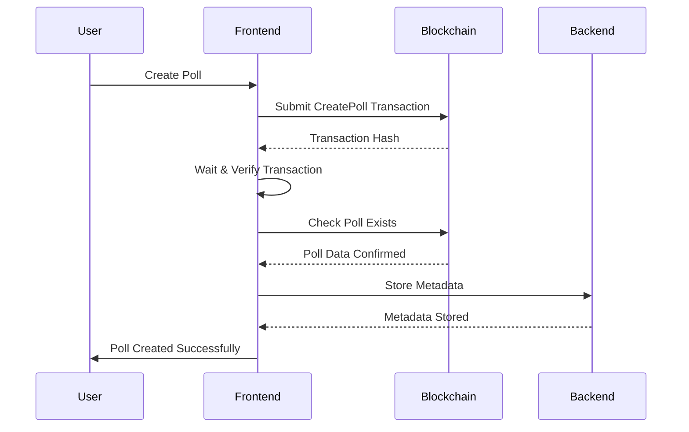
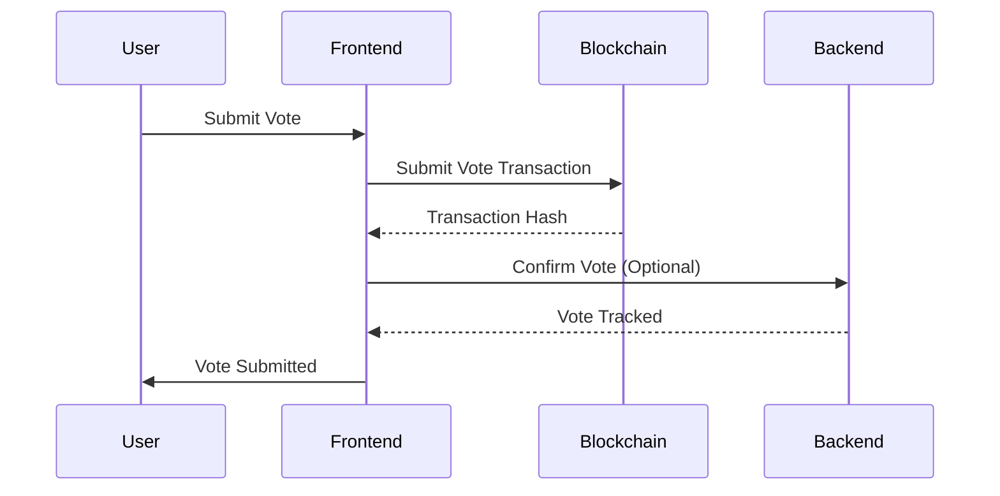
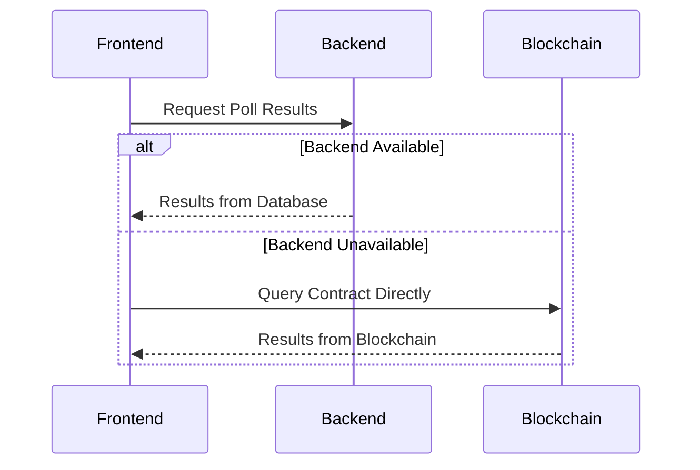

# TPolls Hybrid Storage Approach

This document outlines the hybrid storage strategy used in the TPolls system, which combines blockchain immutability with backend efficiency for optimal performance and data integrity.

## Overview

The TPolls system employs a **dual-layer storage architecture**:

1. **Blockchain Layer** (TON Smart Contract) - Immutable, decentralized storage
2. **Backend Layer** (API + Database) - Fast queries, metadata, and analytics

This hybrid approach ensures data integrity through blockchain while providing enhanced user experience through efficient backend services.

## Architecture Diagram

```
┌─────────────────┐    ┌─────────────────┐    ┌─────────────────┐
│   Frontend      │    │   Backend API   │    │  TON Blockchain │
│   (React App)   │◄──►│   + Database    │◄──►│  Smart Contract │
└─────────────────┘    └─────────────────┘    └─────────────────┘
        │                       │                       │
        │              ┌────────▼────────┐              │
        │              │  Vote Indexer   │              │
        └──────────────┤  Event Listener │◄─────────────┘
                       └─────────────────┘
```

## Storage Breakdown

### 1. Blockchain Storage (Smart Contract)

**Contract Address**: `EQAcDlO2BaUEtKW0Va2YJShs1pzlgHqz8SG1N9OUnGaL46vN`

#### Poll Data Structure
```tact
struct Poll {
    pollId: Int;           // Unique poll identifier
    creator: Address;      // Poll creator's wallet address
    subject: String;       // Poll question/title
    options: map<Int, Cell>; // Poll options (text stored in cells)
    results: map<Int, Int>; // Vote counts per option
    totalVoters: Int;      // Total unique voters
    rewardPool: Int;       // Available rewards (if any)
    rewardPerVote: Int;    // Reward per vote (if any)
}
```

#### What's Stored On-Chain
- ✅ **Core Poll Data**: ID, creator, subject, options
- ✅ **Vote Results**: Vote counts per option, total voters
- ✅ **Vote Prevention**: Prevents double-voting per address
- ✅ **Reward System**: Pool and per-vote rewards
- ✅ **Immutability**: Cannot be modified once created

#### Blockchain Operations
| Operation | Opcode | Purpose | Gas Cost |
|-----------|--------|---------|----------|
| CreatePoll | `1052480048` | Store poll on blockchain | ~0.05 TON |
| Vote | `1011836453` | Record vote immutably | ~0.02 TON |
| ClaimReward | `2912590077` | Claim voting rewards | ~0.02 TON |

### 2. Backend Storage (API + Database)

**API Base URL**: `https://tpolls-api.onrender.com/api`

#### What's Stored in Backend
- ✅ **AI-Generated Content**: Original prompts, generated descriptions
- ✅ **Rich Metadata**: Categories, creation timestamps, descriptions
- ✅ **Analytics Data**: Response trends, popular polls
- ✅ **User Profiles**: Voting history, preferences
- ✅ **Performance Caching**: Frequently accessed poll data
- ✅ **Transaction Tracking**: Blockchain transaction hashes

#### Backend Endpoints
```javascript
// Poll Management
POST /api/simple-blockchain/polls/store-metadata
GET  /api/simple-blockchain/polls/{pollId}/results
GET  /api/simple-blockchain/status

// Vote Tracking
POST /api/simple-blockchain/votes/confirm
GET  /api/polls/{pollId}/votes
GET  /api/voters/{address}/votes

// Analytics
GET  /api/simple-blockchain/stats
GET  /api/voters/{address}/rewards
```

## Hybrid Storage Flow

### Poll Creation Process



**Implementation Steps:**
1. **Blockchain First**: Poll core data stored on-chain
2. **Verification**: Confirm transaction success
3. **Metadata Storage**: Store AI content and metadata in backend
4. **Graceful Degradation**: Poll works even if backend fails

### Vote Submission Process



**Implementation Steps:**
1. **Blockchain Primary**: Vote stored immutably on-chain
2. **Backend Confirmation**: Track vote for analytics (optional)
3. **Immediate Feedback**: User sees confirmation instantly

### Data Retrieval Process



**Implementation Strategy:**
1. **Backend First**: Try fast database query
2. **Blockchain Fallback**: Direct contract query if backend fails
3. **Data Consistency**: Blockchain is always source of truth

## Implementation Details

### Frontend Service (`tpollsContractSimple.js`)

#### Backend Availability Check
```javascript
async _testBackendConnection() {
  try {
    const response = await fetch(`${this.apiBaseUrl}/../health`);
    this.isBackendAvailable = response.ok;
  } catch (error) {
    this.isBackendAvailable = false;
  }
}
```

#### Hybrid Poll Creation
```javascript
async createPoll(pollData) {
  // Step 1: Create on blockchain
  const result = await this.tonConnectUI.sendTransaction({
    messages: [{ address, amount, payload }]
  });
  
  // Step 2: Verify on blockchain
  const verification = await this.verifyPollCreation(pollId);
  
  // Step 3: Store metadata in backend (if available)
  if (this.isBackendAvailable && verification.success) {
    await this._storePollMetadata(pollId, result.boc, metadata);
  }
}
```

#### Hybrid Vote Submission
```javascript
async voteOnPoll(pollId, optionIndex) {
  // Step 1: Submit to blockchain
  const result = await this.tonConnectUI.sendTransaction({
    messages: [{ address, amount, payload }]
  });
  
  // Step 2: Confirm with backend (optional)
  if (this.isBackendAvailable) {
    await this._confirmVote(voteId, result.boc);
  }
}
```

#### Hybrid Results Retrieval
```javascript
async getPollResults(pollId) {
  // Try backend first
  if (this.isBackendAvailable) {
    try {
      const response = await fetch(`${this.apiBaseUrl}/polls/${pollId}/results`);
      if (response.ok) return await response.json();
    } catch (error) {
      console.warn('Backend failed, trying blockchain...');
    }
  }
  
  // Fallback to blockchain
  const results = await this.client.runMethod(address, 'getPollResults', [pollId]);
  return this.transformBlockchainResults(results);
}
```

## Benefits of Hybrid Approach

### 1. **Data Integrity**
- ✅ Blockchain ensures immutable vote records
- ✅ Cannot manipulate poll results
- ✅ Cryptographic proof of votes
- ✅ Decentralized consensus

### 2. **Performance & UX**
- ✅ Fast queries from database
- ✅ Rich metadata and descriptions
- ✅ Advanced analytics and insights
- ✅ Caching for popular polls

### 3. **Resilience**
- ✅ Works without backend (blockchain fallback)
- ✅ Works without blockchain (during maintenance)
- ✅ Graceful degradation
- ✅ Multiple data sources

### 4. **Cost Efficiency**
- ✅ Store minimal data on-chain (expensive)
- ✅ Store rich data off-chain (cheap)
- ✅ Optimize gas usage
- ✅ Reduce user transaction costs

## Data Flow Examples

### Example 1: New Poll Creation

1. **User Creates Poll**: "What's your favorite blockchain?"
2. **Blockchain Stores**:
   ```javascript
   {
     pollId: 1,
     creator: "EQAbc...123",
     subject: "What's your favorite blockchain?",
     options: {0: "Bitcoin", 1: "Ethereum", 2: "TON"},
     results: {0: 0, 1: 0, 2: 0},
     totalVoters: 0
   }
   ```
3. **Backend Stores**:
   ```javascript
   {
     blockchainPollId: 1,
     aiData: {
       originalPrompt: "blockchain preference poll",
       description: "Survey about blockchain preferences",
       category: "technology"
     },
     transactionHash: "abc123...",
     createdAt: "2025-07-24T10:00:00Z"
   }
   ```

### Example 2: Vote Submission

1. **User Votes**: Option 2 (TON)
2. **Blockchain Updates**:
   ```javascript
   {
     results: {0: 0, 1: 0, 2: 1}, // TON gets 1 vote
     totalVoters: 1,
     voterPollKeys: {"hash_user_poll1": true}
   }
   ```
3. **Backend Records**:
   ```javascript
   {
     voteId: "vote_1_EQAbc...123_1627123456",
     pollId: 1,
     voter: "EQAbc...123",
     optionIndex: 2,
     timestamp: "2025-07-24T10:05:00Z",
     transactionHash: "def456..."
   }
   ```

## Error Handling & Fallbacks

### Scenario 1: Backend Unavailable
- ✅ Frontend detects backend failure
- ✅ Switches to direct blockchain queries
- ✅ User experience remains functional
- ❌ Lost: Rich metadata, analytics

### Scenario 2: Blockchain Unavailable
- ✅ Backend serves cached poll data
- ✅ Users can browse existing polls
- ❌ Lost: New polls, new votes, real-time results

### Scenario 3: Both Systems Down
- ❌ Full system unavailable
- ✅ Data preserved (blockchain immutable)
- ✅ Quick recovery when systems restore

## Future Enhancements

### 1. **Enhanced Indexing**
- Real-time vote event listening
- Automatic result synchronization
- Historical vote tracking

### 2. **Analytics Layer**
- Vote trend analysis
- User behavior insights
- Popular poll tracking

### 3. **Caching Strategy**
- Redis for frequently accessed data
- CDN for static poll metadata
- Smart cache invalidation

### 4. **Reward System**
- Automated reward distribution
- Token incentives for participation
- Reputation scoring

## Configuration

### Environment Variables
```bash
# Blockchain Configuration
VITE_SIMPLE_CONTRACT_ADDRESS=EQAcDlO2BaUEtKW0Va2YJShs1pzlgHqz8SG1N9OUnGaL46vN
VITE_TON_NETWORK=testnet
VITE_TONCENTER_ENDPOINT=https://testnet.toncenter.com/api/v2/jsonRPC

# Backend Configuration
VITE_TPOLLS_API=https://tpolls-api.onrender.com/api
REACT_APP_INDEXER_API_URL=http://localhost:3001/api

# Feature Flags
VITE_USE_SIMPLE_CONTRACT=true
```

### Service Detection
```javascript
// Automatic backend detection
this.isBackendAvailable = await this._testBackendConnection();
this.isBlockchainAvailable = await this._testBlockchainStatus();

// Graceful feature degradation
if (!this.isBackendAvailable) {
  console.warn('Backend unavailable - using blockchain-only mode');
}
```

## Security Considerations

### 1. **Blockchain Security**
- ✅ Smart contract prevents double voting
- ✅ Immutable vote records
- ✅ Cryptographic signatures
- ✅ Decentralized consensus

### 2. **Backend Security**
- ✅ API authentication
- ✅ Rate limiting
- ✅ Input validation
- ✅ Transaction verification

### 3. **Data Consistency**
- ✅ Blockchain as ultimate source of truth
- ✅ Backend reconciliation processes
- ✅ Conflict resolution strategies

---

**Document Status**: ✅ **COMPLETE**  
**Last Updated**: 2025-07-24  
**Version**: 1.0  

This hybrid approach ensures TPolls provides both the security of blockchain technology and the performance users expect from modern applications.